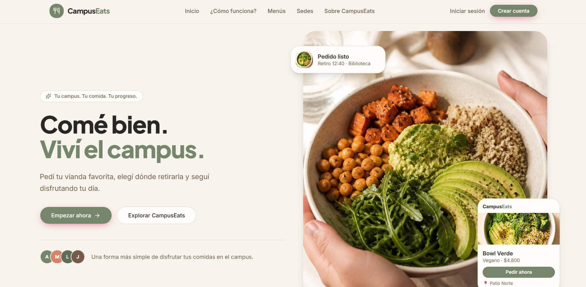
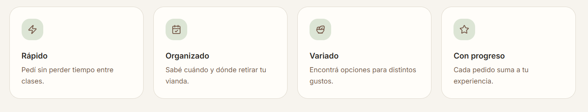

<div align="center">
  

  <br />
  <br />

  

# Campus Eats Frontend

Aplicación web para consultar menús, gestionar pedidos y administrar la operación diaria de viandas.

[](https://react.dev/)
[](https://vite.dev/)
[](https://tailwindcss.com/)
[](#calidad-y-verificación)

</div>

---

## Contenido

- [Descripción](#descripción)
- [Funcionalidades](#funcionalidades)
- [Requisitos](#requisitos)
- [Inicio rápido](#inicio-rápido)
- [Credenciales de prueba](#credenciales-de-prueba)
- [Variables de entorno](#variables-de-entorno)
- [Comandos disponibles](#comandos-disponibles)
- [Rutas y permisos](#rutas-y-permisos)
- [Arquitectura](#arquitectura)
- [Integración con la API](#integración-con-la-api)
- [Cálculo de cupos](#cálculo-de-cupos)
- [Responsabilidades del equipo](#responsabilidades-del-equipo)
- [Calidad y verificación](#calidad-y-verificación)
- [Limitaciones conocidas](#limitaciones-conocidas)
- [Solución de problemas](#solución-de-problemas)
- [Despliegue](#despliegue)

## Descripción

Campus Eats es el frontend React de una aplicación full-stack para gestionar viandas con:

- autenticación mediante JWT;
- roles `usuario` y `admin`;
- catálogo de menús con fecha, precio, tipo y cupo;
- pedidos con seguimiento de estado e historial;
- puntos de retiro configurables;
- administración de pedidos, menús, sedes y usuarios.

El backend es la fuente de verdad para permisos, cupos, estados y validaciones de negocio. Este frontend protege las rutas según el rol y presenta los errores devueltos por la API.



## Funcionalidades

### Usuario

- Registrarse e iniciar sesión.
- Consultar menús disponibles por fecha y tipo.
- Ver precio, imagen, cupo total y cupo restante.
- Crear, editar y cancelar pedidos.
- Elegir turno y sede de retiro.
- Consultar detalle, estado e historial de pedidos.
- Actualizar perfil y contraseña.

### Administrador

- Supervisar todos los pedidos con paginación del servidor.
- Combinar filtros por fecha, estado, menú y tipo de menú.
- Ordenar pedidos por fecha, estado o total.
- Confirmar, entregar o cancelar pedidos.
- Consultar métricas, cupos restantes, pendientes por fecha e historial operativo.
- Crear, editar, activar y desactivar menús.
- Crear, editar, activar y desactivar sedes.
- Crear, editar, activar y desactivar usuarios.
- Asignar los roles `usuario` y `admin`.

No se realizan eliminaciones físicas de sedes o usuarios para preservar el historial.

## Requisitos

Antes de comenzar, instalar:

- [Node.js](https://nodejs.org/) 20 o superior. El proyecto fue verificado con Node.js 22.
- npm 10 o superior.
- Git.

Para ejecutar la aplicación completa también se necesita el backend:

- [ViandaApp_Back](https://github.com/MilagrosCerutti/Campus-Eats/tree/main/CampusApp_Back)

Puertos utilizados por defecto:

| Servicio    | URL                                |
| ----------- | ---------------------------------- |
| Frontend    | `http://localhost:5173`            |
| Backend     | `http://localhost:3000`            |
| API         | `http://localhost:3000/api`        |
| Healthcheck | `http://localhost:3000/api/health` |

## Inicio rápido

La forma recomendada de trabajar localmente es guardar frontend y backend en carpetas hermanas:

```text
Viandas/
|-- Viandas-Back/
`-- Viandas-front/
```

### 1. Clonar ambos repositorios

```bash
git clone https://github.com/MilagrosCerutti/Campus-Eats/tree/main/CampusApp_Back
git clone https://github.com/MilagrosCerutti/Campus-Eats/tree/main/CampusApp_Front
```

### 2. Preparar y ejecutar el backend

```bash
cd CampusApp_Back
npm install
```

Crear un archivo `.env` a partir de `.env.example`:

```env
PORT=3000
JWT_SECRET=reemplazar-con-un-secreto-largo-y-aleatorio
DB_FILE=./data/database.sqlite
CORS_ORIGIN=http://localhost:5173
BUSINESS_TIME_ZONE=America/Argentina/Buenos_Aires
JWT_ISSUER=viandas-api
JWT_AUDIENCE=viandas-frontend
TRUST_PROXY_HOPS=0
SEED_ON_START=false
SYNC_MENUS_ON_START=true
SYNC_SEDES_ON_START=true
```

Inicializar la base de datos y cargar datos de prueba:

```bash
npm run init-db
npm run seed
npm run dev
```

Comprobar que la API está disponible:

```text
http://localhost:3000/api/health
```

### 3. Preparar y ejecutar el frontend

Abrir otra terminal:

```bash
cd Campus-front
npm install
```

Crear `.env.local`:

```env
VITE_API_URL=http://localhost:3000/api
```

Iniciar Vite:

```bash
npm run dev
```

Abrir:

```text
http://localhost:5173
```

## Credenciales de prueba

Las siguientes cuentas son creadas por `npm run seed` en el backend:

| Rol           | Nombre       | Email               | Contraseña |
| ------------- | ------------ | ------------------- | ---------- |
| Administrador | Admin        | `admin@viandas.com` | `admin123` |
| Usuario       | Juan Perez   | `juan@viandas.com`  | `user123`  |
| Usuario       | Maria Garcia | `maria@viandas.com` | `user123`  |

El seed también carga menús, sedes y pedidos de ejemplo.

Estas credenciales son únicamente para desarrollo y pruebas. No ejecutar el seed con credenciales conocidas en un entorno productivo real.

## Variables de entorno

El frontend utiliza una sola variable:

| Variable       | Requerida        | Ejemplo                     | Descripción                           |
| -------------- | ---------------- | --------------------------- | ------------------------------------- |
| `VITE_API_URL` | Sí en producción | `http://localhost:3000/api` | URL base de la API, incluyendo `/api` |

En desarrollo, si no se define, el cliente usa `http://localhost:3000/api`.

En producción, el build falla intencionalmente si `VITE_API_URL` no está configurada.

Ejemplo para producción:

```env
VITE_API_URL=https://api.viandas.example.com/api
```

No agregar secretos al frontend. Toda variable con prefijo `VITE_` puede quedar expuesta en el bundle del navegador.

## Comandos disponibles

| Comando                | Descripción                                 |
| ---------------------- | ------------------------------------------- |
| `npm run dev`          | Inicia el servidor de desarrollo de Vite    |
| `npm run build`        | Genera el build optimizado en `dist/`       |
| `npm run preview`      | Sirve localmente el contenido de `dist/`    |
| `npm run lint`         | Ejecuta ESLint sobre el proyecto            |
| `npm run test`         | Ejecuta Vitest en modo watch                |
| `npm run test:run`     | Ejecuta toda la suite una vez               |
| `npm run format`       | Formatea archivos JavaScript y JSX          |
| `npm run format:check` | Comprueba el formato sin modificar archivos |

Verificación recomendada antes de publicar cambios:

```bash
npm run lint
npm run test:run
npm run build
```

En Windows PowerShell, si la política de ejecución bloquea `npm.ps1`, utilizar:

```powershell
npm.cmd run dev
npm.cmd run test:run
```

## Rutas y permisos

### Públicas

| Ruta        | Descripción      |
| ----------- | ---------------- |
| `/`         | Landing page     |
| `/login`    | Inicio de sesión |
| `/register` | Registro         |

### Usuario autenticado

| Ruta                  | Descripción         |
| --------------------- | ------------------- |
| `/dashboard`          | Resumen personal    |
| `/menus`              | Catálogo disponible |
| `/pedidos`            | Pedidos del usuario |
| `/pedidos/nuevo`      | Creación de pedido  |
| `/pedidos/:id`        | Detalle del pedido  |
| `/pedidos/:id/editar` | Edición del pedido  |
| `/perfil`             | Perfil y seguridad  |

### Administrador

| Ruta                           | Descripción                    |
| ------------------------------ | ------------------------------ |
| `/admin`                       | Operación general y pedidos    |
| `/admin/menus`                 | Gestión de menús               |
| `/admin/sedes`                 | Gestión de sedes               |
| `/admin/usuarios`              | Gestión de usuarios y roles    |
| `/admin/pedidos/:id/historial` | Historial operativo del pedido |

Las rutas administrativas requieren una sesión con rol `admin`. La API también valida el JWT y devuelve `403` cuando la cuenta no tiene permisos.

## Arquitectura

```text
src/
|-- components/ui/          Componentes base de interfaz
|-- features/
|   |-- admin/              Operación y gestores administrativos
|   |-- auth/               Login, registro y sesión
|   |-- dashboard/          Inicio del usuario
|   |-- landing/            Página pública
|   |-- menus/              Catálogo y servicios de menús
|   |-- pedidos/            Creación, detalle e historial
|   |-- perfil/             Perfil y seguridad
|   `-- sedes/              Servicios de sedes
|-- lib/                    Axios y utilidades compartidas
|-- router/                 Rutas públicas, protegidas y admin
|-- shared/                 Shell, navegación y feedback
|-- App.jsx                 Composición principal
`-- main.jsx                Punto de entrada
```

Cada feature mantiene sus páginas, componentes, hooks y servicios. Las solicitudes HTTP se concentran en archivos `services`, mientras que `src/lib/axios.js` agrega automáticamente el JWT almacenado en `localStorage`.

## Integración con la API

El cliente Axios utiliza:

```http
Authorization: Bearer <token>
Content-Type: application/json
```

Comportamiento global de errores:

| Estado | Comportamiento                              |
| ------ | ------------------------------------------- |
| `401`  | Limpia la sesión y redirige a login         |
| `403`  | Abre un diálogo de acceso denegado          |
| `404`  | Muestra notificación de recurso inexistente |
| `500`  | Muestra notificación de error interno       |

Los módulos administrativos consumen operaciones de gestión para:

- menús: creación, edición parcial, activación y desactivación;
- sedes: creación, edición, activación y desactivación;
- usuarios: creación, edición, asignación de rol, activación y desactivación.

### Endpoints principales

Todas las rutas, excepto registro, login, listado público de menús y listado público de sedes, requieren:

```http
Authorization: Bearer <token>
```

| Método         | Endpoint                              | Acceso          | Uso principal                                      |
| -------------- | ------------------------------------- | --------------- | -------------------------------------------------- |
| `POST`         | `/api/auth/register`                  | Público         | Registrar una cuenta                               |
| `POST`         | `/api/auth/login`                     | Público         | Obtener JWT y usuario                              |
| `GET`          | `/api/menus`                          | Público         | Listar menús por `fecha`, `tipo` y `activo`        |
| `GET`          | `/api/menus/:id`                      | Admin           | Consultar un menú                                  |
| `POST`         | `/api/menus`                          | Admin           | Crear un menú                                      |
| `PUT`          | `/api/menus/:id`                      | Admin           | Editar un menú                                     |
| `PATCH`        | `/api/menus/:id/activar`              | Admin           | Activar un menú                                    |
| `PATCH`        | `/api/menus/:id/desactivar`           | Admin           | Desactivar un menú                                 |
| `GET`          | `/api/pedidos`                        | Autenticado     | Buscar pedidos con filtros, paginación y orden     |
| `GET`          | `/api/pedidos/:id`                    | Autenticado     | Consultar detalle                                  |
| `GET`          | `/api/pedidos/:id/historial`          | Autenticado     | Consultar historial                                |
| `POST`         | `/api/pedidos`                        | Autenticado     | Crear pedido                                       |
| `PUT`          | `/api/pedidos/:id`                    | Autenticado     | Editar menú, cantidad, turno, sede u observaciones |
| `PATCH`        | `/api/pedidos/:id/cancelar`           | Autenticado     | Cancelar pedido                                    |
| `PATCH`        | `/api/pedidos/:id/confirmar`          | Admin           | Confirmar pedido                                   |
| `PATCH`        | `/api/pedidos/:id/entregar`           | Admin           | Marcar como entregado                              |
| `GET`          | `/api/pedidos/resumen`                | Admin           | Obtener resumen operativo                          |
| `GET/POST/PUT` | `/api/sedes` y `/api/sedes/:id`       | Según operación | Consultar y gestionar sedes                        |
| `GET/POST/PUT` | `/api/usuarios` y `/api/usuarios/:id` | Admin           | Gestionar usuarios y roles                         |

El listado de pedidos envía los parámetros `estado`, `fecha`, `menuId`, `tipo`, `page`, `limit`, `sortBy` y `order`. Los filtros, la paginación y el ordenamiento son resueltos por la API.

El formulario de edición muestra únicamente menús activos correspondientes a la fecha original del pedido. El total mostrado durante la selección es estimativo: el backend recalcula y devuelve el total definitivo según el precio real del menú.

El resumen administrativo consume directamente `GET /api/pedidos/resumen` y presenta pedidos por estado y fecha, pendientes por fecha, cupos restantes, importe estimado confirmado, pendientes de entrega, recaudación y menú más solicitado del día.

### Errores de negocio visibles

El frontend muestra el mensaje específico entregado por la API para distinguir, entre otros casos:

- menú inexistente;
- menú inactivo;
- fecha no disponible;
- cupo insuficiente;
- pedido inexistente;
- operación no permitida por estado;
- falta de permisos.

## Cálculo de cupos

El backend es la fuente de verdad del cupo disponible. El frontend presenta el valor `cupoDisponible` devuelto por la API y utiliza `cupoDiario` únicamente como respaldo visual.

La regla de negocio es:

```text
cupoDisponible = cupoDiario - suma(cantidad de pedidos pendientes o confirmados)
```

- Los pedidos `pendiente` y `confirmado` consumen cupo.
- Los pedidos `cancelado` y `entregado` no consumen cupo disponible.
- Al crear o editar un pedido, el backend valida nuevamente el cupo dentro de una transacción.
- El panel administrador muestra el cupo restante por menú y agrupa los pedidos pendientes por fecha.

## Responsabilidades del equipo

Esta división puede adaptarse a los integrantes reales antes de la entrega:

| Área             | Responsabilidad                                                                                        |
| ---------------- | ------------------------------------------------------------------------------------------------------ |
| Frontend         | Rutas, componentes, formularios, consumo de API, accesibilidad, estados visuales y pruebas UI          |
| Backend          | API REST, JWT, permisos, validaciones de negocio, persistencia, transacciones y pruebas de integración |
| Integración y QA | Contratos HTTP, datos de prueba, documentación, revisión de flujos y verificación final                |

Las decisiones compartidas incluyen nombres de campos, estados de pedido, permisos por rol, manejo de errores y criterios de aceptación.

## Calidad y verificación

El proyecto utiliza:

- ESLint para análisis estático;
- Vitest y Testing Library para pruebas;
- Prettier para formato;
- Vite para build y optimización.

La suite cubre rutas protegidas, autenticación, componentes compartidos, utilidades y regresiones visuales importantes.

Para verificar una instalación limpia:

```bash
npm install
npm run lint
npm run test:run
npm run build
```

Resultado esperado:

- ESLint finaliza sin errores.
- Todos los tests pasan.
- Vite genera la carpeta `dist/`.

## Limitaciones conocidas

- El resumen administrativo depende de las agregaciones entregadas por `GET /api/pedidos/resumen`; el frontend no recalcula importes ni cupos definitivos.
- El token JWT se conserva en `localStorage`, una decisión adecuada para este trabajo académico. En un entorno productivo se recomienda evaluar cookies `HttpOnly` y una estrategia de renovación de sesión.
- Las imágenes se referencian mediante `imagenUrl`; el frontend no incluye carga binaria de archivos.
- Los cambios concurrentes de cupo pueden hacer que un menú visible deje de tener disponibilidad antes de confirmar. La API vuelve a validar y el frontend muestra el error correspondiente.
- No existe eliminación física de sedes, usuarios o menús vinculados a información histórica; se utiliza activación y desactivación.

## Solución de problemas

### El frontend muestra errores de red

1. Comprobar que el backend está ejecutándose en `http://localhost:3000`.
2. Abrir `http://localhost:3000/api/health`.
3. Verificar `VITE_API_URL` en `.env.local`.
4. Reiniciar Vite después de cambiar variables de entorno.

### El navegador bloquea la solicitud por CORS

Verificar en el `.env` del backend:

```env
CORS_ORIGIN=http://localhost:5173
```

La URL debe coincidir exactamente con el origen utilizado por el frontend.

### No puedo ingresar con las cuentas de prueba

Ejecutar en el backend:

```bash
npm run init-db
npm run seed
```

El seed no vuelve a insertar usuarios si la base ya contiene datos. Para reiniciar completamente una base local de desarrollo, seguir las instrucciones del repositorio backend antes de eliminar o reemplazar el archivo SQLite.

### Recibo `401`

La sesión expiró o el token no es válido. Cerrar sesión e ingresar nuevamente.

### Recibo `403`

La cuenta autenticada no posee el rol requerido. Las operaciones administrativas requieren el usuario `admin@viandas.com` o cualquier cuenta activa con rol `admin`.

### Las imágenes de menús no cargan

`imagenUrl` puede ser una URL completa o una ruta relativa del backend, por ejemplo:

```text
/assets/menu.jpg
```

La aplicación resuelve las rutas relativas utilizando el origen configurado en `VITE_API_URL`.

### PowerShell bloquea npm

Si aparece un error relacionado con `npm.ps1`, utilizar `npm.cmd`:

```powershell
npm.cmd install
npm.cmd run dev
```

## Despliegue

### Build

Configurar primero la API pública:

```env
VITE_API_URL=https://api.viandas.example.com/api
```

Generar el build:

```bash
npm ci
npm run build
```

Publicar el contenido de `dist/` en un hosting estático.

### Configuración requerida

- Configurar fallback de SPA hacia `index.html`.
- Autorizar el dominio del frontend en `CORS_ORIGIN` del backend.
- Servir frontend y backend mediante HTTPS.
- No utilizar las credenciales del seed en producción.
- Mantener `VITE_API_URL` apuntando a la URL pública de la API.

## Stack principal

| Área        | Tecnología                                |
| ----------- | ----------------------------------------- |
| UI          | React 19, Tailwind CSS 4, Base UI, Lucide |
| Navegación  | React Router 7                            |
| Formularios | React Hook Form, Zod                      |
| Datos       | Axios                                     |
| Animaciones | Motion                                    |
| Feedback    | Sonner                                    |
| Tooling     | Vite 8, ESLint 10, Prettier               |
| Tests       | Vitest, Testing Library                   |

---

<div align="center">
  <strong>Campus Eats</strong>
  <br />
  Frontend React para gestión de viandas, pedidos y operación administrativa.
</div>
