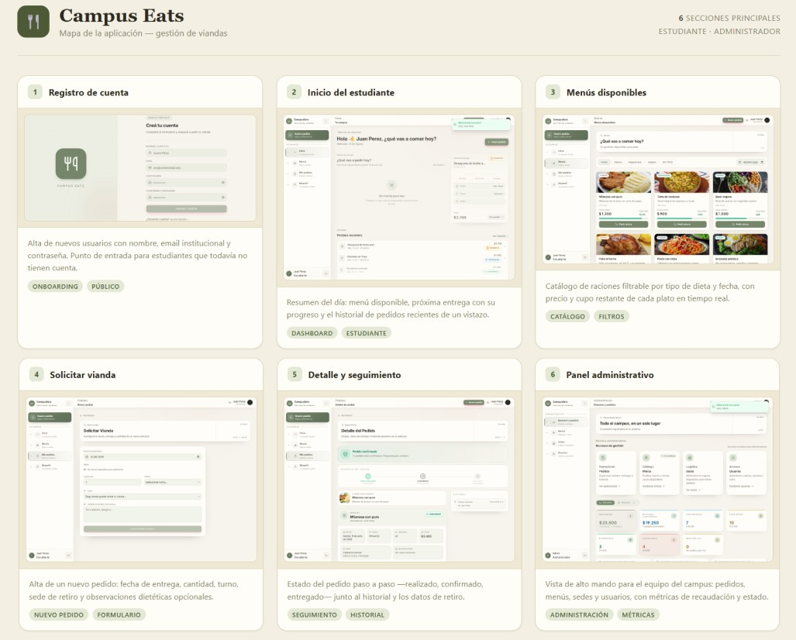

# Campus Eats

Aplicación web full-stack para gestionar pedidos de viandas con cupos diarios, autenticación JWT y control de acceso por rol.
<div align="center">
  
</div>

## Demo

**Aplicación:** https://campus-eats-myapp.vercel.app/

**Usuario demo:** `admin.demo@campuseats.com`

**Contraseña demo:** `CampusEatsDemo2026!`

## Repositorios

| Parte | Tecnología | Repositorio |
|---|---|---|
| Backend | Node.js · Express · SQLite | https://github.com/MilagrosCerutti/Campus-Eats/tree/master/CampusApp_Back |
| Frontend | React 19 · Vite · Tailwind | https://github.com/MilagrosCerutti/Campus-Eats/tree/master/CampusApp_Front |

Cada repositorio contiene su propio `README.md` con instrucciones detalladas de instalación, configuración y uso:

- **Backend:** ver [`README.md` del backend](https://github.com/MilagrosCerutti/Campus-Eats/tree/master/CampusApp_Back)
- **Frontend:** ver [`README.md` del frontend](https://github.com/MilagrosCerutti/Campus-Eats/tree/master/CampusApp_Front)

---

## Inicio rápido

El sistema necesita **backend y frontend corriendo en simultáneo**.

### 1 — Backend

```bash
git clone https://github.com/MilagrosCerutti/Campus-Eats/tree/master/CampusApp_Back
cd CampusApp_Back
npm install
cp .env.example .env        # editar JWT_SECRET
npm run init-db
npm run seed
npm run dev                 # http://localhost:3000
```

### 2 — Frontend

```bash
git clone https://github.com/MilagrosCerutti/Campus-Eats/tree/master/CampusApp_Front
cd CampusApp_Front
npm install
cp .env.example .env.local  # VITE_API_URL=http://localhost:3000/api
npm run dev                 # http://localhost:5173
```

Para más detalle sobre variables de entorno, semilla de datos y despliegue, ver los READMEs individuales.

---

## Usuarios de prueba

Creados por `npm run seed` en el backend:

| Rol | Email | Contraseña |
|---|---|---|
| Administrador | `admin@viandas.com` | `admin123` |
| Usuario | `juan@viandas.com` | `user123` |
| Usuario | `maria@viandas.com` | `user123` |

---

## Rutas del frontend

| Ruta | Acceso | Descripción |
|---|---|---|
| `/` | Público | Landing page |
| `/login` | Público | Inicio de sesión |
| `/register` | Público | Registro de cuenta |
| `/dashboard` | Autenticado | Resumen personal del usuario |
| `/menus` | Autenticado | Catálogo de menús disponibles |
| `/pedidos` | Autenticado | Listado de pedidos propios |
| `/pedidos/nuevo` | Autenticado | Crear pedido |
| `/pedidos/:id` | Autenticado | Detalle e historial del pedido |
| `/pedidos/:id/editar` | Autenticado | Editar pedido activo |
| `/perfil` | Autenticado | Datos personales del usuario |
| `/admin` | Admin | Panel operativo (resumen + pedidos) |
| `/admin/menus` | Admin | Gestión de menús |
| `/admin/sedes` | Admin | Gestión de sedes |
| `/admin/usuarios` | Admin | Gestión de usuarios y roles |
| `/admin/pedidos/:id/historial` | Admin | Historial de auditoría de un pedido |
| `*` | Público | Página 404 |

---

## Endpoints principales del backend

| Método | Ruta | Acceso | Descripción |
|---|---|---|---|
| `POST` | `/api/auth/register` | Público | Registrar usuario |
| `POST` | `/api/auth/login` | Público | Obtener JWT |
| `GET` | `/api/menus` | Público | Listar menús (`fecha`, `tipo`, `activo`) |
| `GET` | `/api/pedidos` | Autenticado | Listar pedidos (`estado`, `fecha`, `menuId`, `tipo`, `page`, `limit`, `sortBy`, `order`) |
| `GET` | `/api/pedidos/resumen` | Admin | Resumen operativo |
| `GET` | `/api/pedidos/:id` | Autenticado | Detalle de pedido |
| `GET` | `/api/pedidos/:id/historial` | Autenticado | Historial de pedido |
| `POST` | `/api/pedidos` | Autenticado | Crear pedido |
| `PUT` | `/api/pedidos/:id` | Autenticado | Editar pedido |
| `PATCH` | `/api/pedidos/:id/cancelar` | Autenticado | Cancelar pedido |
| `PATCH` | `/api/pedidos/:id/confirmar` | Admin | Confirmar pedido |
| `PATCH` | `/api/pedidos/:id/entregar` | Admin | Marcar como entregado |

Listado completo de endpoints en el [README del backend](https://github.com/MilagrosCerutti/Campus-Eats/tree/master/CampusApp_Back#endpoints).

---

## Cálculo del cupo disponible

```
cupoDisponible = cupoDiario − Σ cantidad (pedidos pendiente + confirmado)
```

- Los pedidos `cancelado` y `entregado` no consumen cupo.
- La validación ocurre en el servicio del backend, dentro de una transacción serializada para evitar carreras de escritura concurrentes.
- El frontend muestra el `cupoDisponible` devuelto por la API y no lo recalcula.

---

## JWT, roles y permisos

Al hacer login exitoso, el backend devuelve un JWT firmado con `JWT_SECRET`. El payload contiene `id`, `nombre`, `email` y `rol` del usuario — nunca la contraseña.

El frontend almacena el token en `localStorage` y lo adjunta automáticamente en cada request mediante un interceptor de Axios:

```http
Authorization: Bearer <token>
```

| Rol | Permisos |
|---|---|
| `usuario` | Ver, crear, editar y cancelar sus propios pedidos |
| `admin` | Todo lo anterior + confirmar, entregar, gestionar menús/sedes/usuarios y ver todos los pedidos |

Las rutas del frontend están protegidas con guardias (`ProtectedRoute`, `AdminRoute`) que redirigen al usuario si no tiene sesión o rol suficiente. El backend valida independientemente el JWT y el rol en cada operación protegida, devolviendo `401` o `403` según corresponda.

El registro público siempre crea cuentas con rol `usuario`.

---

## Pruebas

### Backend (obligatorio)

```bash
cd CampusApp_Back
npm test
```

Suite con Jest + Supertest. Cubre: login correcto e inválido, acceso sin JWT, acceso con rol insuficiente, listado con filtros, detalle existente e inexistente, creación válida e inválida por cantidad y cupo, edición inválida por cupo, transiciones de estado no permitidas y concurrencia de cupos.

### Frontend (opcional)

```bash
cd CampusApp_Front
npm run test:run
```

Suite con Vitest + Testing Library.

---

## Limitaciones conocidas

- **SQLite** opera en una sola instancia; no escala horizontalmente sin cambiar la base de datos.
- **No hay refresh tokens:** al expirar el JWT el usuario debe volver a iniciar sesión.
- **No hay carga de imágenes:** las imágenes se referencian por URL; el backend las sirve desde disco.
- **No hay eliminación física** de menús, sedes ni usuarios vinculados a historial; se usan estados activo/inactivo.
- Los tests de frontend son mínimos; la cobertura de reglas de negocio está en los tests del backend.

---

## Estructura del proyecto

```
Campus-Eats/
├── CampusApp_Back/           Backend Node.js + Express + SQLite
│   ├── src/
│   │   ├── routes/         Endpoints con express.Router()
│   │   ├── controllers/    Adaptadores HTTP
│   │   ├── services/       Reglas de negocio y cupo
│   │   ├── middlewares/    Auth JWT, autorización, validación, errores
│   │   ├── validators/     Esquemas de validación de entrada
│   │   └── database/       Conexión, migraciones y seeds
│   └── tests/              Jest + Supertest
│
└── CampusApp_Front/          Frontend React + Vite
    └── src/
        ├── features/       auth · pedidos · admin · menus · perfil
        ├── components/ui/  Componentes base
        ├── lib/            Axios con interceptores JWT
        └── router/         Rutas públicas, protegidas y admin
```
